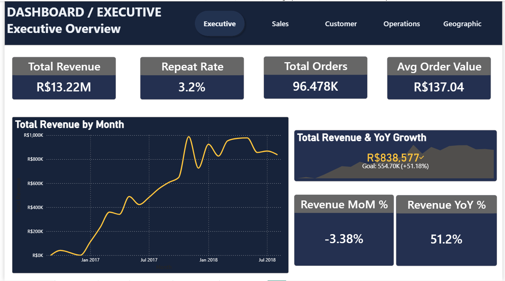
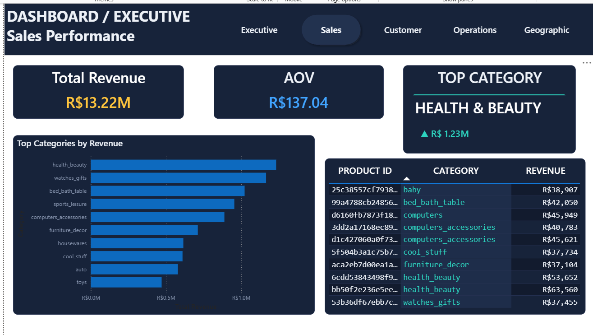
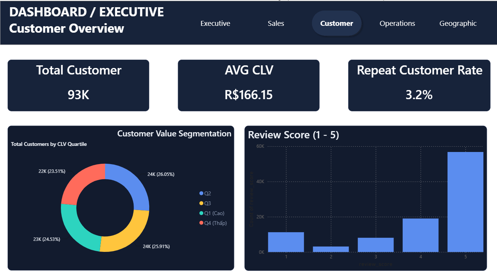
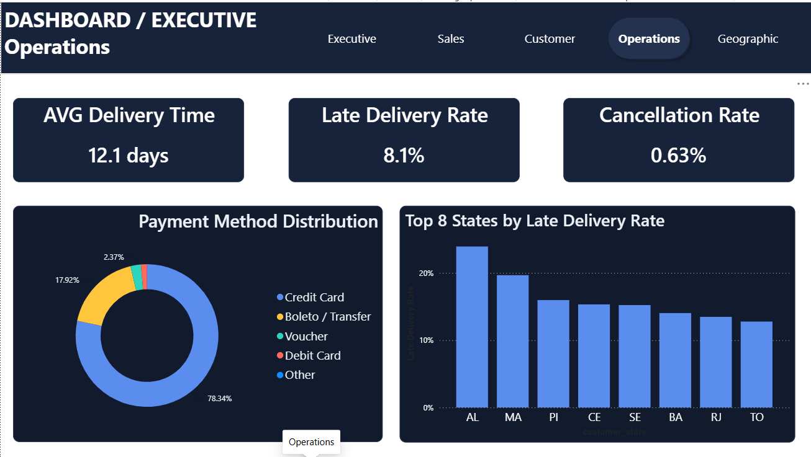
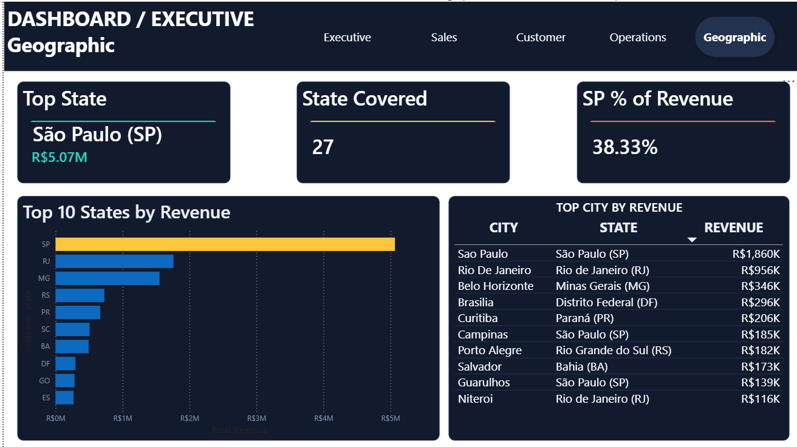

# 📊 Olist E-commerce Sales & Customer Analytics

End-to-end Data Analyst portfolio project: biến dữ liệu giao dịch thô của sàn thương mại điện tử Olist (Brazil) thành insight kinh doanh thực tế — từ làm sạch dữ liệu, thiết kế database, viết SQL phân tích, đến dashboard và khuyến nghị chiến lược.

---

## 🎯 Mục tiêu dự án

Đóng vai trò Data Analyst tại một công ty thương mại điện tử, trả lời các câu hỏi quản lý quan tâm:
- Doanh thu có tăng trưởng không?
- Sản phẩm/category nào mang lại doanh thu cao nhất?
- Khách hàng nào giá trị nhất?
- Khu vực nào hoạt động tốt nhất?
- Phương thức thanh toán nào được ưa chuộng?
- Delivery hiệu quả ra sao?
- Yếu tố nào ảnh hưởng đến sự hài lòng khách hàng?

## 🗂️ Dataset

**Olist Brazilian E-commerce Public Dataset** (Kaggle) — 9 bảng CSV, giai đoạn 09/2016 – 08/2018:
`customers`, `orders`, `order_items`, `order_payments`, `order_reviews`, `products`, `product_category_name_translation`, `sellers`, `geolocation`.

| | |
|---|---|
| Orders | ~99,441 |
| Customers | ~99,441 (96,096 khách hàng thật, phân biệt qua `customer_unique_id`) |
| Order Items | ~112,650 |
| Products | ~32,951 |
| Sellers | ~3,095 |

## 🛠️ Tech Stack

| Hạng mục | Công cụ |
|---|---|
| Ngôn ngữ | Python (Pandas, NumPy, Matplotlib, Seaborn) |
| Database | PostgreSQL |
| Phân tích | SQL (Window Functions, CTE, RFM, Cohort Analysis) |
| Trực quan hóa | Power BI Desktop |
| Báo cáo | ReportLab (PDF), Markdown |
| Version Control | Git |

## 🏗️ Kiến trúc project

```
CSV Files → Data Understanding → Python Data Cleaning → EDA
   → Relational Database Design → PostgreSQL → SQL Business Analysis
   → Power BI Dashboard → Business Recommendations
```

## 📁 Cấu trúc thư mục

```
olist-analytics/
├── data/
│   ├── raw/            # 9 file CSV gốc
│   ├── cleaned/         # Dữ liệu sau Phase 4 (Data Cleaning)
│   └── processed/       # Dữ liệu sau Phase 5 (Feature Engineering) — load vào PostgreSQL
│
├── notebooks/
│   ├── 01_data_profiling.py      # Phase 3
│   ├── 02_data_cleaning.py       # Phase 4
│   ├── 03_feature_engineering.py # Phase 5
│   ├── 04_load_to_postgres.py    # Phase 7
│   └── eda.ipynb                 # Phase 9 (đã chạy sẵn, có biểu đồ)
│
├── sql/
│   ├── schema.sql               # Phase 6 — DDL + Views
│   ├── basic_queries.sql        # 20 query cơ bản
│   ├── intermediate_queries.sql # 12 query CASE/CTE/Subquery
│   ├── advanced_queries.sql     # 12 query Window Functions
│   └── business_queries.sql     # 16 query RFM/Cohort/Deep-dive
│
├── dashboard/
│   └── dashboard.pbix   # Bản mockup thiết kế tham chiếu cho Power BI
│
│
├── reports/
│   ├── Profiling_Report.md
│   ├── Cleaning_Log.md
│   ├── EDA_Summary.md
│   ├── eda_charts/               # 10 biểu đồ PNG
│   
│
└── README.md
```

## 🚀 Cách chạy lại project

```bash
# 1. Cài thư viện
pip install pandas numpy matplotlib seaborn sqlalchemy psycopg2-binary jupyter

# 2. Data Profiling → Cleaning → Feature Engineering
python notebooks/01_data_profiling.py
python notebooks/02_data_cleaning.py
python notebooks/03_feature_engineering.py

# 3. Tạo database & load dữ liệu (cần PostgreSQL đã cài sẵn)
createdb olist_db
psql -U postgres -d olist_db -f sql/schema.sql
python notebooks/04_load_to_postgres.py     # nhớ sửa DB_CONFIG trong file trước khi chạy

# 4. Chạy SQL phân tích (pgAdmin4 hoặc psql)
psql -U postgres -d olist_db -f sql/basic_queries.sql

# 5. Mở EDA notebook
jupyter notebook notebooks/eda.ipynb

## 📊 Dashboard

# 5. Mở EDA notebook
jupyter notebook notebooks/eda.ipynb
```

---

## 📊 Dashboard

Power BI dashboard gồm **5 interactive pages**, tập trung vào các khía cạnh quan trọng của hoạt động kinh doanh:

- 📈 Executive Overview
- 💰 Sales Performance
- 👥 Customer Overview
- 🚚 Operations Dashboard
- 🌎 Geographic Analysis

**Power BI file:** `dashboard/dashboard.pbix`

### Dashboard Preview

| Executive Dashboard | Sales Dashboard |
|:-------------------:|:---------------:|
|  |  |

| Customer Dashboard | Operations Dashboard |
|:------------------:|:--------------------:|
|  |  |

### Geographic Dashboard

<p align="center">
  
</p>

---

## 👤 Tác giả

Dự án portfolio cá nhân — Data Analyst.
Dataset gốc: [Olist Brazilian E-commerce Public Dataset](https://www.kaggle.com/datasets/olistbr/brazilian-ecommerce) (Kaggle).